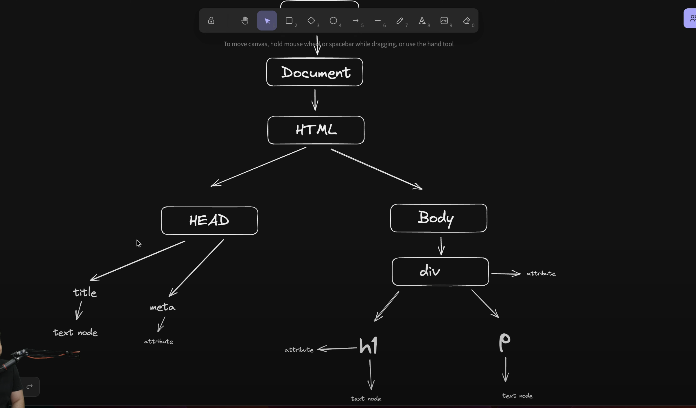

# Javascript-Learning

- documentation to follow 
    1.  https://ecma-international.org/publications-and-standards/standards/ecma-262/        - standardised JS(not a JS documentation, it's a standard to write JS)
    2.  https://developer.mozilla.org/en-US/              - by mozilla org
 
    ( use 2 only, in some cases refer 1)

- Objects and web events are very much or most important ones

- Dynamically typed or statically typed language ?  
Yes ✅ JavaScript is a dynamically typed language.
    You don’t declare the type of a variable (like int, string, bool).
    The type is decided at runtime, depending on the value you assign.
    A variable can hold values of different types at different times.

-  Stack & Heap Memory : 
    - Primitive (stack) , Non-Primitive (Heap) 
    -  stack se copy create hoti hai & heap se referece
    - 

-  Variables in JS are Very Powerfull, they can hold so much things

-  ES6 in 2015, with lot of new features ( `one of them is arrow function` )

-  ### IMPORTANT
    - RUN console.log(this) in browser console and node environment
    - MOst Global object in browser -- WINDOW OBJECT
    - MOst global object in node environment -- {} empty object

    - If you use this in a standalone function, in strict mode it is undefined, in non-strict mode it is widnow object

    - Arrow functions differ in their handling of this: they inherit this from the parent scope at the time they are defined. This behavior makes arrow functions particularly useful for callbacks and preserving context

- ## JS CODE EXECUTION AND CALLSTACK
    - 
    - 
    

- ## DOM Structure
    - 

- HTML collection , Array , Node List/ collection all are different things

- Accessing Elements : 
    - `getElementById()`
    - `getElementByClassName()` -Returns HTML collecion
    - `getElementByTagName()`

    - `querySelector()`
    - `querySelectorAll()`  : Returns NodeList Array.from() converts to array

- `getAttribute()` / `setAttribute()` : setAttribute overwrite always

- Updating/Accessing the content :
    - `innerHTML()` : descendants
    - `outerHTML()` : descendants + self
    - `innerText()`   : shows text that is visible actually [ trigger properties ]
    - `textContent()`: shows text that is hidden by some css properties like `display: none`

- Manuplating Style : 
    - `element.style.backgroudColor` = ""

- Parent -> children : 
    -  `parent.children` : returns HTML collection 
    - `parent.firstElementChild` 
    - `parent.lastElementChild`
    - nth child
        - // Select the 3rd child directly
        - `const thirdChild = document.querySelector(".container :nth-child(3)");`
        - `console.log(thirdChild);`

        - OR

        - `parent.children[n]`

- child -> parent :
    - `child.parentElement`

- sibling
    - `element.nextElementSibling`
    - `previousElementSibling`

- Nodes : 
    - `parent.childNodes()` : counts spaces + elements + comments all as Nodes, counts all of them 

- Create a New Element and Append in DOM Tree 
    - `let div = document.createElement()`  -- creates a elment
    - `let text = document.createTextNode()` -- `div.appendChild(div)`

    - OR

    - Just use attributes of div and do modifications

- Edit Elements : 
    - `replaceWith` -- replace a element with a new
    - `outerHTML`

- Remove Elements : 

