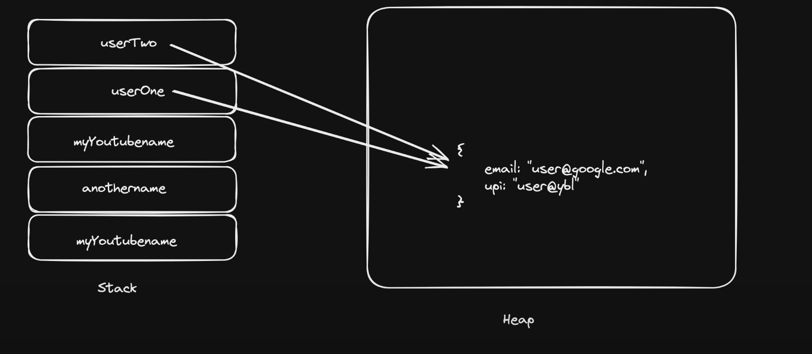

# Javascript-Learning

- documentation to follow 
    1.  https://ecma-international.org/publications-and-standards/standards/ecma-262/        - standardised JS(not a JS documentation, it's a standard to write JS)
    2.  https://developer.mozilla.org/en-US/              - by mozilla org
 
    ( use 2 only, in some cases refer 1)

- Objects and web events are very much or most important ones

- Dynamically typed or statically typed language ?  
Yes ✅ JavaScript is a dynamically typed language.
    You don’t declare the type of a variable (like int, string, bool).
    The type is decided at runtime, depending on the value you assign.
    A variable can hold values of different types at different times.

-  Stack & Heap Memory : 
    - Primitive (stack) , Non-Primitive (Heap) 
    -  stack se copy create hoti hai & heap se referece
    - 

-  Variables in JS are Very Powerfull, they can hold so much things

